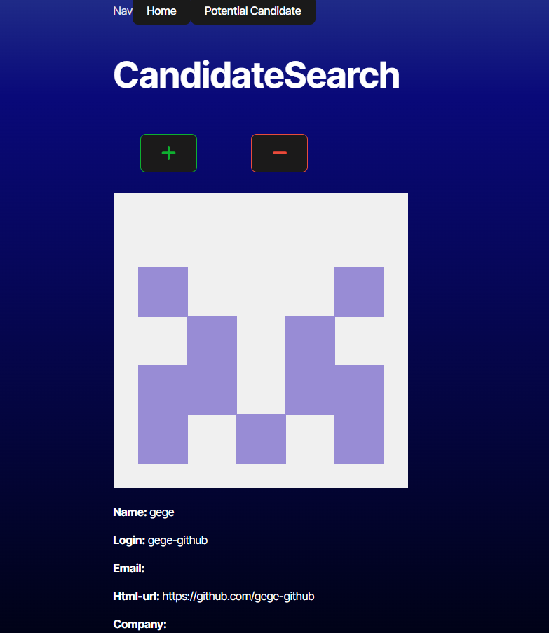

Candidate Search 

#Description
The Candidate Search Application is a web-based tool that allows users to review potential candidates and save or reject them. It displays relevant details about each candidate, provides navigation through available candidates, and maintains a list of saved candidates even after page reloads.

#Features
✅ Candidate Display:
Shows a single candidate at a time, displaying their name, location, avatar, email, GitHub profile URL, and company.

✅ Candidate Selection:
"+" Button: Saves the current candidate to the list of potential candidates and moves to the next.
"-" Button: Skips the current candidate without saving and moves to the next.

✅ End of Candidates Notification:
Displays a message when there are no more candidates available to review.

✅ Saved Candidates Page:
Shows a list of previously saved candidates with their name, location, avatar, email, GitHub profile URL, and company.

✅ Persistent Data:
The list of saved candidates remains available even after page reloads.

✅ No Saved Candidates Notification:
If no candidates have been saved, an appropriate message is displayed.

#Technologies Used
React.js – For building the interactive UI.
React Router – For handling navigation between pages.
Local Storage / Database – For persisting saved candidates.
CSS / Font Awesome – For styling and responsiveness.
REST API GitHub API – For fetching candidate data dynamically.

#Installation
To run this project locally, follow these steps:

Clone the Repository:

git clone: https://github.com/DavidSwider/CandidateSearch.git
cd candidate-search

Install Dependencies:
npm install

Build the application:
npm run build

Start the Development Server:
npm run dev

Open http://localhost:3000/ in your browser.

#Usage
Navigate through candidates using the "+" and "-" buttons.
Save candidates to the Potential Candidates list.
View saved candidates on the Potential Candidates page.
Refresh the page to see that saved candidates persist.

#Screenshots


Deployment
The application is deployed at:
🔗 Live Application

Contact
📧 Email: Davidswider6@gmail.com
🔗 GitHubRepo: https://github.com/DavidSwider/CandidateSearch


# React + TypeScript + Vite

This template provides a minimal setup to get React working in Vite with HMR and some ESLint rules.

Currently, two official plugins are available:

* [@vitejs/plugin-react](https://github.com/vitejs/vite-plugin-react/blob/main/packages/plugin-react/README.md), which uses [Babel](https://babeljs.io/) for Fast Refresh
* [@vitejs/plugin-react-swc](https://github.com/vitejs/vite-plugin-react-swc), which uses [SWC](https://swc.rs/) for Fast Refresh

## Expanding the ESLint configuration

If you're developing a production application, we recommend updating the configuration to enable type-aware lint rules:

* Configure the top-level `parserOptions` property as follows:

```js
export default {
  // other rules...
  parserOptions: {
    ecmaVersion: 'latest',
    sourceType: 'module',
    project: ['./tsconfig.json', './tsconfig.node.json'],
    tsconfigRootDir: __dirname,
  },
}
```

* Replace `plugin:@typescript-eslint/recommended` with `plugin:@typescript-eslint/recommended-type-checked` or `plugin:@typescript-eslint/strict-type-checked`.
* Optionally, add `plugin:@typescript-eslint/stylistic-type-checked`.
* Install [eslint-plugin-react](https://github.com/jsx-eslint/eslint-plugin-react) and add `plugin:react/recommended` and `plugin:react/jsx-runtime` to the `extends` list.

---
© 2024 edX Boot Camps LLC. Confidential and Proprietary. All Rights Reserved.